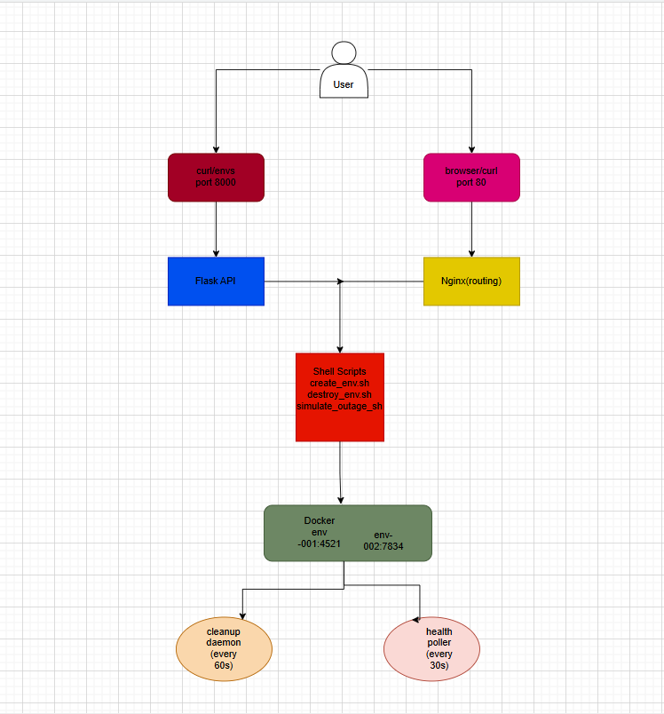

 Self-Service Platform (Mini Heroku)

A self-service platform where users can spin up isolated temporary environments,
deploy apps, simulate outages, monitor health, and auto-destroy everything.

## Architecture



## Prerequisites

- Linux VM (Ubuntu 20.04/22.04)
- Docker installed
- Python 3.10+
- make
- jq
- uuid-runtime

```bash
# Install dependencies
curl -fsSL https://get.docker.com | sh
sudo usermod -aG docker $USER
sudo apt install -y make jq uuid-runtime python3-pip
```

## Quick Start (zero to first running env in 5 commands)

```bash
git clone https://github.com/YOURUSERNAME/self-service-platform
cd self-service-platform
python3 -m venv venv && source venv/bin/activate
pip install flask requests
make up
```

Then in a new terminal:
```bash
make create
# Enter name: myapp
# Enter TTL: 1800
```

## Makefile Commands

| Command | Description |
|---|---|
| `make up` | Start Nginx + daemon + API |
| `make down` | Stop everything, destroy all envs |
| `make create` | Create new environment |
| `make destroy ENV=env-abc123` | Destroy specific environment |
| `make logs ENV=env-abc123` | Tail environment logs |
| `make health` | Show all env health statuses |
| `make simulate ENV=env-abc123 MODE=crash` | Simulate outage |
| `make clean` | Wipe all state and logs |

## API Endpoints

| Method | Endpoint | Description |
|---|---|---|
| POST | `/envs` | Create environment |
| GET | `/envs` | List all active envs |
| DELETE | `/envs/:id` | Destroy environment |
| GET | `/envs/:id/logs` | Last 100 lines of app.log |
| GET | `/envs/:id/health` | Last 10 health checks |
| POST | `/envs/:id/outage` | Simulate outage |

## Full Demo Walkthrough

### 1. Start the platform
```bash
make up
```

### 2. Create an environment
```bash
make create
# name: myapp, TTL: 600
```

### 3. Check health
```bash
make health
curl http://localhost:<PORT>/health
```

### 4. Simulate outage
```bash
make simulate ENV=<env-id> MODE=crash
```

### 5. Observe degraded status (within 90s)
```bash
curl http://localhost:8000/envs/<env-id>/health
```

### 6. Recover
```bash
make simulate ENV=<env-id> MODE=recover
```

### 7. Watch auto-destroy
```bash
# Wait for TTL to expire, then:
cat logs/cleanup.log
ls envs/  # should be empty
```

## Outage Simulation Modes

| Mode | What it does | How to recover |
|---|---|---|
| `crash` | Kills the container | `MODE=recover` |
| `pause` | Freezes the container | `MODE=recover` |
| `network` | Cuts network access | `MODE=recover` |
| `recover` | Restores everything | — |
| `stress` | Spikes CPU | Wait 60s |

## Known Limitations

- Nginx routing uses localhost subdomains — requires `/etc/hosts` edits or a real domain for external access
- Flask API runs in debug mode — use gunicorn for production
- Log shipping uses background processes, not a proper log aggregator
- No authentication on the API endpoints
- Single VM means no horizontal scaling